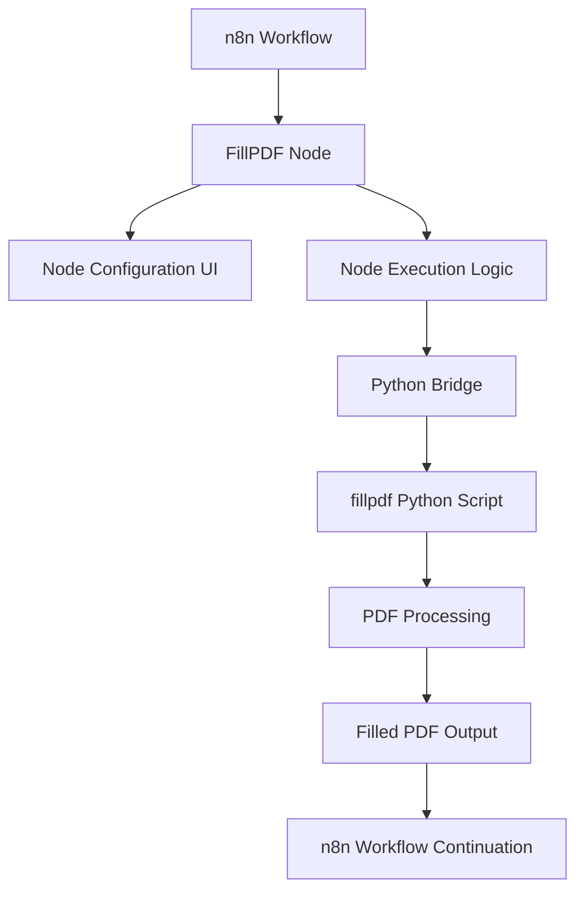

# Design Document

## Overview

The n8n-fillpdf-node is a community node that bridges n8n workflows with PDF form filling capabilities using the Python fillpdf library. The node will be implemented as a TypeScript-based n8n node that spawns Python processes to handle PDF operations, providing a seamless integration between n8n's JavaScript runtime and Python's PDF processing capabilities.

## Architecture

### High-Level Architecture



### Component Interaction

The node follows n8n's standard architecture pattern:
1. **Node Definition**: TypeScript class extending INodeType
2. **Node Configuration**: JSON schema defining UI and parameters
3. **Execution Logic**: Main processing function handling input/output
4. **Python Bridge**: Subprocess management for Python script execution
5. **Error Handling**: Comprehensive error catching and n8n-compatible error reporting

## Components and Interfaces

### 1. Node Definition (`FillPdf.node.ts`)

**Primary Interface**: `INodeType`

Key properties:
- `description`: Node metadata and UI configuration
- `execute()`: Main execution function
- `methods`: Optional helper methods for dynamic UI updates

**Configuration Schema**:
```typescript
interface IFillPdfNodeParams {
  pdfSource: 'upload' | 'url' | 'binary';
  pdfFile?: string;
  pdfUrl?: string;
  fieldMappings: IFieldMapping[];
  outputFormat: 'binary' | 'file' | 'both';
  outputPath?: string;
  flattenPdf: boolean;
}

interface IFieldMapping {
  pdfFieldName: string;
  valueSource: 'static' | 'expression';
  staticValue?: string;
  expression?: string;
}
```

### 2. Python Bridge (`python-bridge.ts`)

**Purpose**: Manages Python subprocess execution and data exchange

**Key Methods**:
- `executePythonScript()`: Spawns Python process with JSON input
- `validatePythonEnvironment()`: Checks fillpdf availability
- `handlePythonError()`: Processes Python error output

**Data Exchange Format**:
```typescript
interface IPythonInput {
  action: 'fill' | 'inspect';
  pdfData: string; // base64 encoded PDF
  fieldMappings?: Record<string, any>;
  options: {
    flatten: boolean;
    outputFormat: string;
  };
}

interface IPythonOutput {
  success: boolean;
  data?: string; // base64 encoded result PDF
  fields?: IFieldInfo[];
  error?: string;
  metadata?: {
    fieldCount: number;
    processingTime: number;
  };
}
```

### 3. Python Script (`fillpdf-processor.py`)

**Purpose**: Handles actual PDF processing using fillpdf library

**Key Functions**:
- `inspect_pdf()`: Extracts form field information
- `fill_pdf()`: Populates PDF with provided data
- `validate_fields()`: Ensures field compatibility
- `encode_output()`: Converts result to base64 for transport

**Dependencies**:
- `fillpdf`: Core PDF form filling library
- `json`: Data exchange with Node.js
- `base64`: Binary data encoding
- `sys`: Command line argument handling

### 4. Field Inspector (`field-inspector.ts`)

**Purpose**: Provides dynamic UI updates based on PDF field detection

**Key Methods**:
- `loadPdfFields()`: Triggers Python inspection of uploaded PDF
- `updateFieldMappings()`: Refreshes UI with detected fields
- `validateMappings()`: Ensures all required fields are mapped

## Data Models

### PDF Field Information
```typescript
interface IFieldInfo {
  name: string;
  type: 'text' | 'checkbox' | 'radio' | 'dropdown';
  required: boolean;
  options?: string[]; // For dropdown/radio fields
  maxLength?: number; // For text fields
  defaultValue?: string;
}
```

### Node Input/Output
```typescript
interface INodeInputData {
  json: {
    pdfData?: string;
    fieldValues?: Record<string, any>;
    [key: string]: any;
  };
  binary?: {
    [key: string]: IBinaryData;
  };
}

interface INodeOutputData {
  json: {
    success: boolean;
    fieldsProcessed: number;
    outputPath?: string;
    metadata: {
      originalFieldCount: number;
      filledFieldCount: number;
      processingTime: number;
    };
  };
  binary?: {
    pdf: IBinaryData;
  };
}
```

## Error Handling

### Error Categories

1. **Configuration Errors**
   - Missing PDF source
   - Invalid field mappings
   - Malformed expressions

2. **Runtime Errors**
   - Python environment issues
   - fillpdf library errors
   - PDF processing failures
   - File I/O errors

3. **Data Errors**
   - Corrupted PDF files
   - Incompatible field types
   - Missing required fields

### Error Handling Strategy

```typescript
class FillPdfError extends NodeOperationError {
  constructor(
    node: INode,
    message: string,
    public errorType: 'config' | 'runtime' | 'data',
    public details?: any
  ) {
    super(node, message);
  }
}
```

**Error Recovery**:
- Graceful degradation for non-critical errors
- Detailed error messages with actionable guidance
- Logging for debugging purposes
- Fallback mechanisms where appropriate

## Testing Strategy

### Unit Tests

1. **Node Configuration Tests**
   - Parameter validation
   - UI schema correctness
   - Default value handling

2. **Python Bridge Tests**
   - Subprocess management
   - Data serialization/deserialization
   - Error propagation

3. **Field Mapping Tests**
   - Type conversion accuracy
   - Expression evaluation
   - Validation logic

### Integration Tests

1. **End-to-End PDF Processing**
   - Various PDF types and field combinations
   - Different input data formats
   - Output format variations

2. **Error Scenario Testing**
   - Invalid PDF files
   - Missing Python dependencies
   - Network failures (for URL-based PDFs)

3. **Performance Testing**
   - Large PDF files
   - Batch processing scenarios
   - Memory usage optimization

### Test Data

- Sample PDF forms with various field types
- Mock n8n workflow contexts
- Edge case scenarios (empty PDFs, complex forms)

### Testing Tools

- **Jest**: Primary testing framework
- **n8n-workflow**: n8n testing utilities
- **Mock Python Scripts**: Simulated Python responses
- **PDF Generators**: Creating test PDF forms

## Implementation Considerations

### Python Environment Management
- Check for Python availability during node initialization
- Provide clear installation instructions for fillpdf
- Consider bundling Python dependencies (advanced feature)

### Performance Optimization
- Reuse Python processes for batch operations
- Implement caching for frequently used PDFs
- Stream large files to avoid memory issues

### Security Considerations
- Validate PDF files before processing
- Sanitize user input for Python execution
- Implement file size limits
- Secure temporary file handling

### Cross-Platform Compatibility
- Windows, macOS, and Linux support
- Path handling differences
- Python executable detection

### Extensibility
- Plugin architecture for additional PDF operations
- Custom field type handlers
- Integration with other PDF libraries